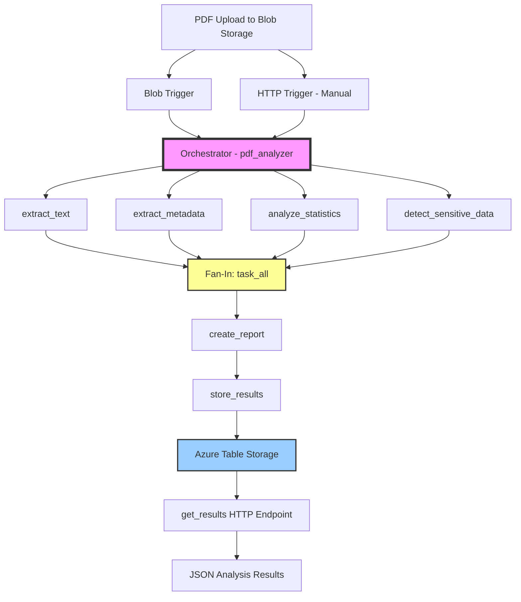

```markdown
# PDF Document Analyzer - Lab 2

## By Bryan Edler 041016930
---

## Architecture Diagram



### Architecture Components

| Component | Description |
|-----------|-------------|
| **Blob Trigger** | Automatically starts analysis when a PDF is uploaded to the `pdfs` container |
| **HTTP Trigger** | Manually starts analysis for testing purposes |
| **Orchestrator** | Coordinates the Fan-Out/Fan-In pattern and chaining |
| **Activities** | 4 parallel analyses running simultaneously |
| **Table Storage** | Stores analysis results for later retrieval |
| **HTTP Endpoint** | Retrieves results for a specific PDF |

---

## Setup Instructions

### Prerequisites
- Python 3.10+
- Azure Functions Core Tools v4
- Azurite for local development
- Azure CLI
- Azure subscription (for deployment)

### Local Development Setup

1. **Clone the repository**
```bash
git clone <your-repo-url>
cd pdf-analyzer-lab2
```

2. **Create and activate virtual environment**
```bash
python3 -m venv .venv
source .venv/bin/activate  # On Windows: .venv\Scripts\activate
```

3. **Install dependencies**
```bash
pip install -r requirements.txt
```

4. **Start Azurite (local storage emulator)**
```bash
azurite --silent --skipApiVersionCheck --location ~/azurite_data
```

5. **Start the function app**
```bash
func start --python
```

6. **Upload a test PDF**
```bash
# Create a test PDF
python -c "
from reportlab.lib.pagesizes import letter
from reportlab.pdfgen import canvas
c = canvas.Canvas('test.pdf', pagesize=letter)
c.drawString(100, 750, 'Test PDF for Analysis')
c.drawString(100, 730, 'Contains test@example.com')
c.save()
"

# Upload to Azurite
python upload_pdf.py
```

7. **Retrieve results**
```bash
curl http://localhost:7071/api/get_results/test.pdf | python -m json.tool
```

### Azure Deployment

1. **Login to Azure**
```bash
az login
```

2. **Create resource group**
```bash
az group create --name pdf-analyzer-rg --location canadacentral
```

3. **Create storage account**
```bash
STORAGE_ACCOUNT="pdfanalyzer$(openssl rand -hex 4)"
az storage account create --name $STORAGE_ACCOUNT --resource-group pdf-analyzer-rg --sku Standard_LRS --location canadacentral
```

4. **Create function app**
```bash
FUNCTION_APP="pdfanalyzer$(openssl rand -hex 4)"
az functionapp create \
  --resource-group pdf-analyzer-rg \
  --consumption-plan-location canadacentral \
  --runtime python \
  --runtime-version 3.11 \
  --functions-version 4 \
  --name $FUNCTION_APP \
  --storage-account $STORAGE_ACCOUNT \
  --os-type linux
```

5. **Set connection string**
```bash
CONN_STRING=$(az storage account show-connection-string --name $STORAGE_ACCOUNT --resource-group pdf-analyzer-rg --query connectionString --output tsv)
az functionapp config appsettings set --name $FUNCTION_APP --resource-group pdf-analyzer-rg --settings "AzureWebJobsStorage=$CONN_STRING"
```

6. **Create container**
```bash
az storage container create --name pdfs --account-name $STORAGE_ACCOUNT --connection-string "$CONN_STRING"
```

7. **Deploy**
```bash
func azure functionapp publish $FUNCTION_APP --build remote
```

8. **Test in Azure**
```bash
# Upload PDF
az storage blob upload --account-name $STORAGE_ACCOUNT --container-name pdfs --file test.pdf --name test.pdf --connection-string "$CONN_STRING" --overwrite

# Get results
curl https://$FUNCTION_APP.azurewebsites.net/api/get_results/test.pdf | python -m json.tool
```

---

## Demo Video

[](https://youtu.be/LK69Vm1I_M0)

**Video Link:** [https://youtu.be/YOUR_VIDEO_ID](https://youtu.be/LK69Vm1I_M0)

**Video Contents:**
1. PDF upload to Azurite with blob trigger firing
2. Parallel execution showing all 4 analysis messages
3. Results retrieval with JSON output
4. Azure deployment and cloud testing
5. Code walkthrough with team members

---

## AI Disclosure

**This project was developed with the assistance of AI tools:**

| Tool | Usage |
|------|-------|
| **GitHub Copilot** | Code suggestions, auto-completion, and debugging assistance |
| **ChatGPT** | Architecture design, documentation writing, and troubleshooting |
| **Azure CLI** | Deployment automation and infrastructure management |

**AI Usage Policy:**
- All AI-generated code was reviewed, tested, and validated 
- The final code reflects my understanding and decisions
- AI was used as a productivity tool, not as a substitute for learning
- All AI suggestions were critically evaluated before implementation

**Transparency Statement:**
- The Durable Functions orchestrator and activity functions were designed with AI assistance
- The Fan-Out/Fan-In pattern was implemented based on AI recommendations
- I verified all AI-generated code for correctness and security

---

## Troubleshooting

### Common Issues

| Issue | Solution |
|-------|----------|
| `ModuleNotFoundError` | Run `pip install -r requirements.txt` |
| Port 7071 already in use | `sudo fuser -k 7071/tcp` |
| Azurite connection issues | Ensure Azurite is running: `azurite --silent --skipApiVersionCheck` |
| 401 Unauthorized in Azure | Use function key: `?code=YOUR_KEY` in the URL |

---

## Technologies Used

| Technology | Version | Purpose |
|------------|---------|---------|
| Python | 3.10+ | Programming language |
| Azure Functions | v4 | Serverless platform |
| Durable Functions | v2 | Orchestration pattern |
| Azure Blob Storage | - | PDF storage |
| Azure Table Storage | - | Results storage |
| PyPDF2 | 3.0.1 | PDF parsing |
| pdfplumber | 0.10.3 | Text extraction |
| Azure CLI | latest | Deployment |

---

